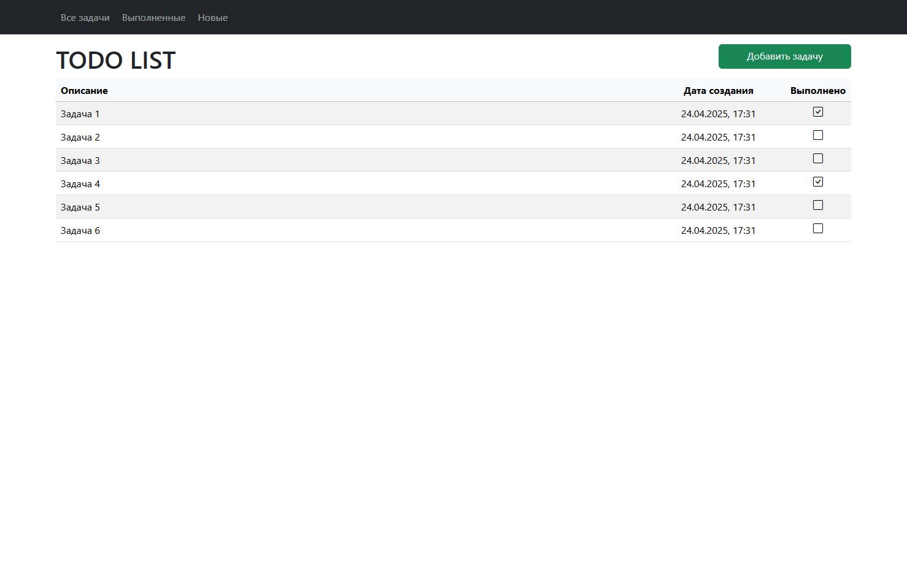
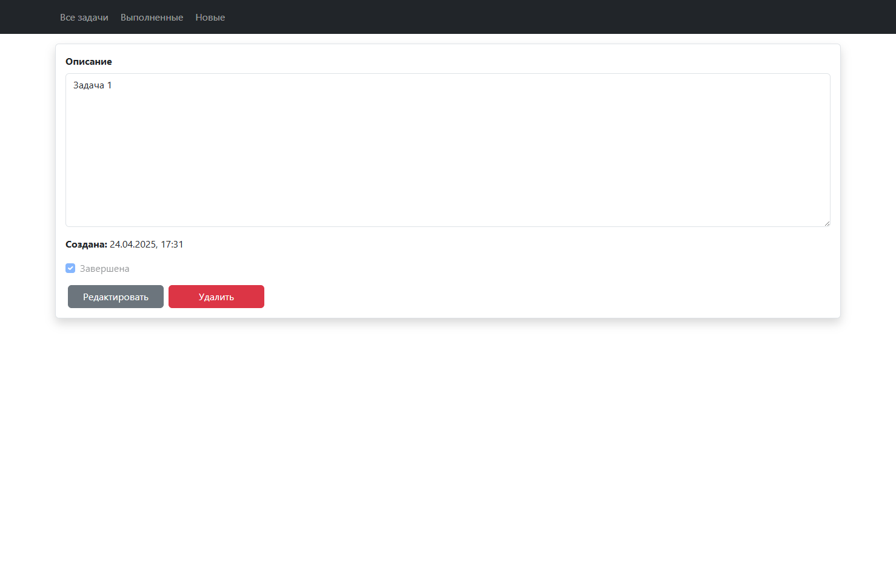

# job4j_todo. TODOList: Приложение для заметок

## Оглавление

- [О проекте](#о-проекте)
- [Стек технологий](#стек-технологий)
- [Требования к окружению](#требования-к-окружению)
- [Запуск проекта](#запуск-проекта)
- [Основные функции](#основные-функции)
- [Страницы приложения](#страницы-приложения)
-

## О проекте

Проект представляет собой веб-приложение для ведения списка задач.
Основная цель — предоставить пользователям удобный интерфейс для
создания задач и сохранения информации об их выполнении.

## Стек технологий

- **Spring Boot**
- **Thymeleaf**
- **Bootstrap**
- **Hibernate**
- **PostgreSQL**

## Требования к окружению

- **Java 17**
- **Maven 3.9**
- **PostgreSQL 17**

## Запуск проекта

1. **Клонируйте репозиторий:**

       git clone https://github.com/tasker312/job4j_todo
       cd job4j_todo

2. **Создайте базу данных:**

       create database cinema;

3. **Измените данные для подключения к базе данных:**

       db/liquibase.properties
       src/main/resources/hibernate.cfg.xml

4. **Запустите приложение:**

       mvn spring-boot:run -Pproduction

5. **Откройте приложение в браузере:**

   Перейдите по адресу [http://localhost:8080](http://localhost:8080)

## Основные функции

- **Ведение списка задач:** Создание, редактирование и отметка о выполнении поставленных задач.
- **Регистрация и вход:** Пользователи могут создавать учетные записи и входить в систему для доступа к своим задачам.

## Страницы приложения

### Список задач

Возможность отображения всех задач, только выполненных и только невыполненных задач.

### Описание задачи

Возможность создания новой задачи, просмотра существующей, редактирование, отметки выполнения.

